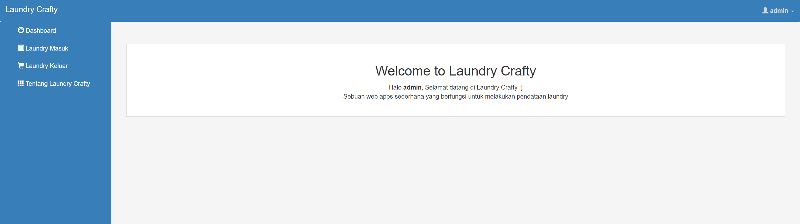
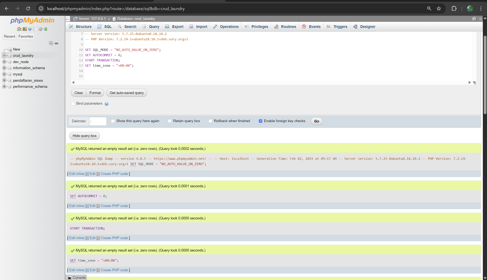
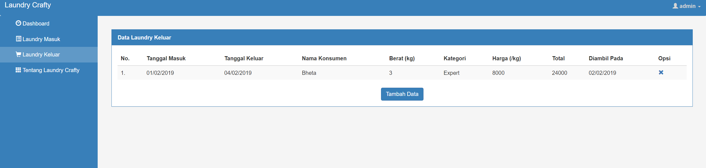
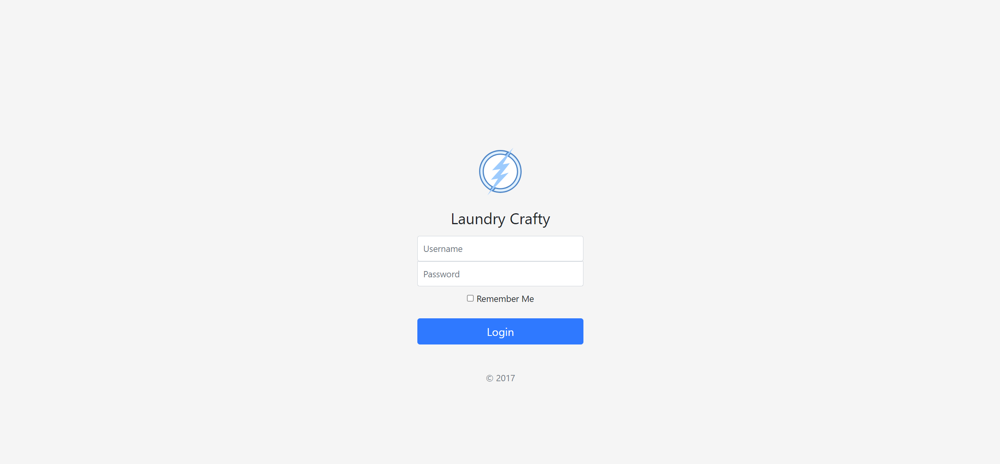

# Latihan CRUD 2 

Referensi : [RMAlan Laundry](https://github.com/rmalan/laundrycrafty/blob/master/crud_laundry.sql)

[Source Code](laundry)

## Tampilan dashboard

## Tampilan database phpmyadmin

## Tampilan laundry masuk

## Tampilan laundry keluar

## Tampilan login

