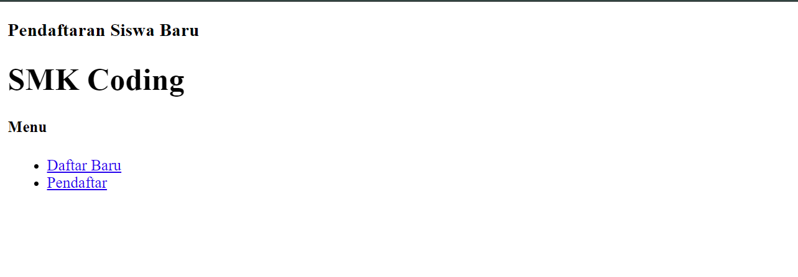
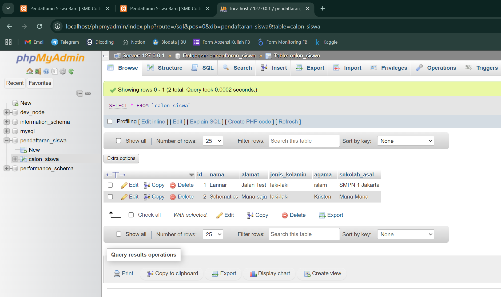
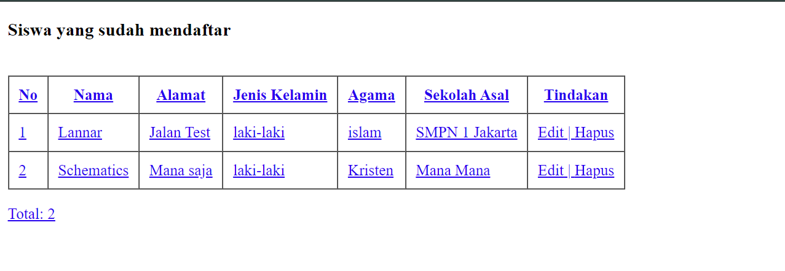

# Backend menggunakan PHP 

Referensi : [Petani Kode](https://www.petanikode.com/tutorial-php-mysql/)

[Source Code](code)

## Tampilan awal

## Tampilan database phpmyadmin

## Tampilan database web

